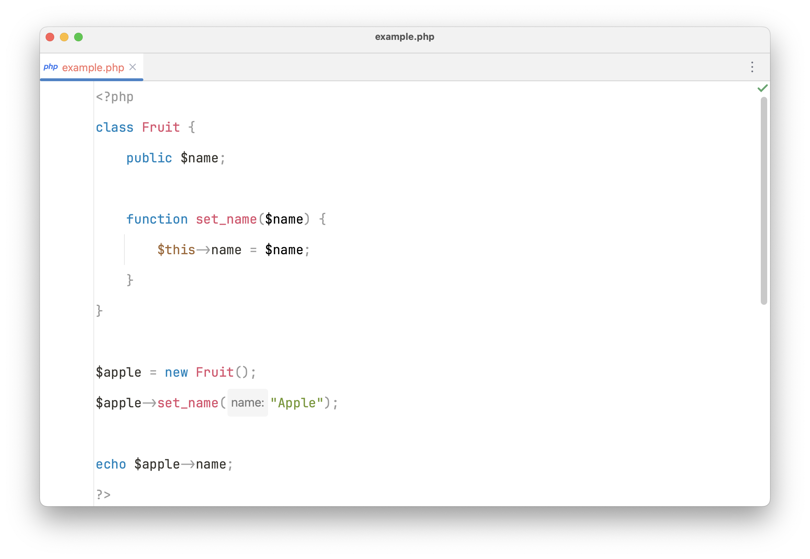
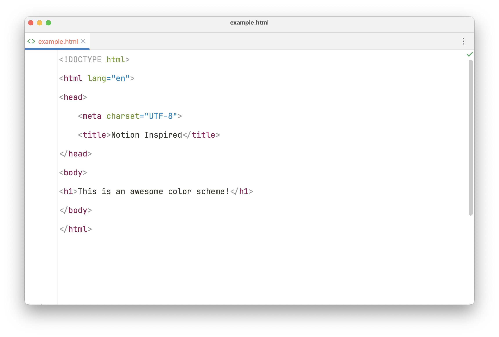
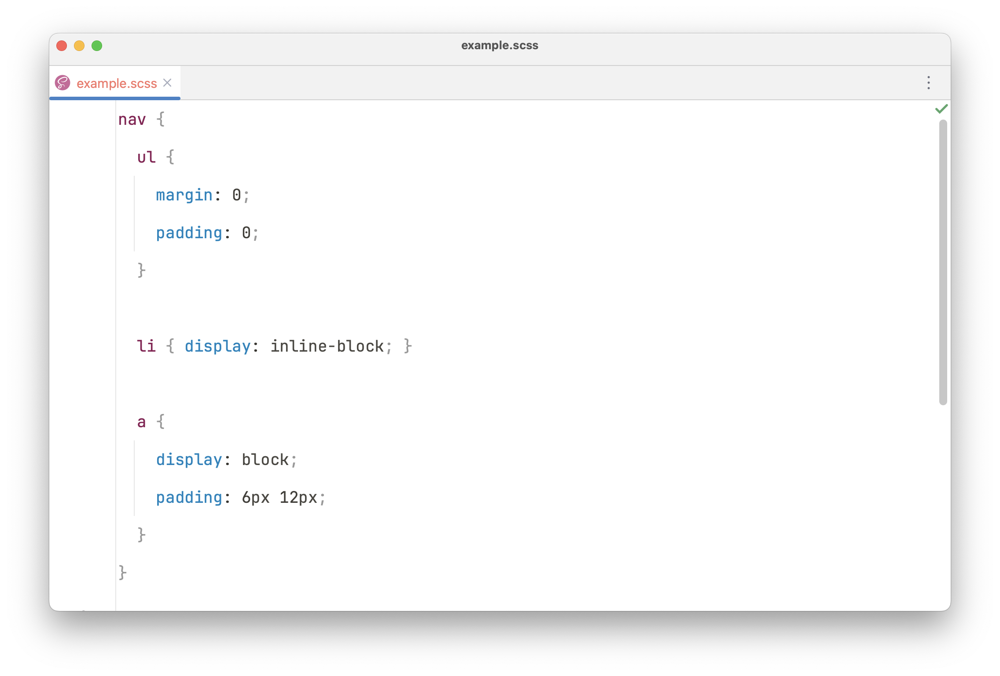

# 🎨 Notion Inspired color scheme

If you like using [Notion](https://www.notion.so/product) like many people, and you're a developer, you might have used the **code blocks**.

With this **Notion Inspired** light color scheme I attempt to replicate the ✨ look and feel ✨of the code blocks color scheme within Notion.

## 🖌️ Previews & colors

| Color                                                        | HEX     |
|--------------------------------------------------------------|---------|
|  | #DE4F6C |
|  | #8C1A54 |
|  | #0082BE |
|  | #71982C |
|  | #937043 |
|  | #999999 |
|  | #373530 |

## ⚡️ Installation

1. Download the color scheme **.icls** file located [here](./jetbrains/Notion_Inspired.icls).
2. In your JetBrains IDE go to `Settings | Editor | Color Scheme`.
3. Press the settings icon on the right side of the dropdown and press `Import Scheme...`.
3. Select the **.icls** file you've downloaded in step 1.
4. All set! 🔥

## 📚 Supported languages

This scheme is created with the [PhpStorm](https://www.jetbrains.com/phpstorm) IDE by [JetBrains](https://www.jetbrains.com/) and has been optimised for the following:

- PHP
- HTML
- CSS
- Sass / Scss / Less
- Javascript / Typescript
- SQL

> The color scheme should be good for use in other JetBrains IDEs, if not feel free to contribute some updates 🚀
 
## 📈 Other IDEs

Working towards bringing this theme to other popular IDEs as well. 

Planning to provide variants for:
- Visual Studio Code
- Sublime Text

## ⚠️ Issues

Having issues with some color combinations? Unfortunately the color combination won't be for everyone. 

However, in case of really *breaking* combinations you're always welcome to point these out!